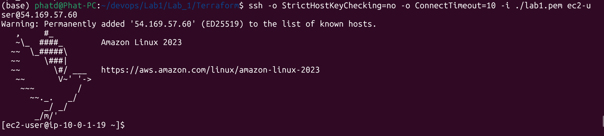
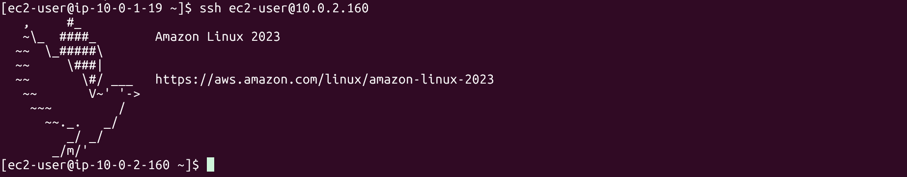

# Team Members
Group 21
- **Đặng Hữu Phát** 
- **Lê Bình Nguyên** 
- **Châu Thế Vĩ**

---

# EC2 Connectivity Testing

After provisioning the infrastructure using Terraform or CloudFormation, you can test connectivity between the EC2 instances as follows:

---

## 1: Get EC2 IP Addresses


## 2: SSH into Public EC2

Grant permission to your private key and connect to the public EC2 instance:

```bash
chmod 400 lab1.pem
ssh -i lab1.pem ec2-user@$PUBLIC_IP
```

Output:


---

## 3: SSH into Private EC2 via Public EC2

### On your local machine:

Start the SSH agent and add your key:

```bash
eval "$(ssh-agent -s)"
ssh-add lab1.pem
```

Then SSH into the **public EC2 with agent forwarding**:

```bash
ssh -A -i lab1.pem ec2-user@$PUBLIC_IP
```

Once inside the public EC2, connect to the private EC2:

```bash
ssh ec2-user@$PRIVATE_IP
```

Output:


---

