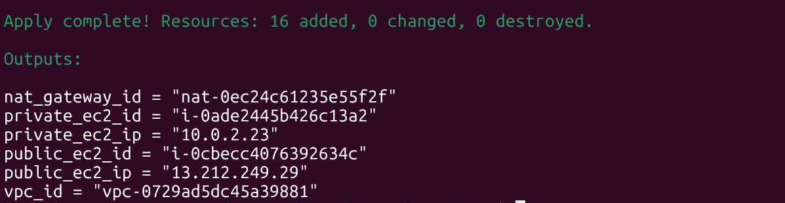

# AWS Infrastructure Deployment with Terraform

This project automates the provisioning of a fully functional AWS VPC environment using Terraform. It includes a public and private subnet, EC2 instances, Internet/NAT Gateways, routing tables, and security groups.

---

## Project Structure

```

Terraform/
├── main.tf                  
├── outputs.tf               
├── variables.tf                                
├── modules/                 
│   ├── vpc/
│   ├── subnet/
│   ├── internet-gateway/
│   ├── nat-gateway/
│   ├── route-table-public/
│   ├── route-table-private/
│   ├── security-group-public/
│   ├── security-group-private/
│   └── ec2/
└── .terraform.lock.hcl      

````

---

## Prerequisites

- **Terraform**
- **AWS CLI** configured with access credentials.
- An **existing key pair** in your AWS account for SSH access.
- Required permissions:
  - `EC2`, `VPC`, `IAM`, `EIP`, `Route Tables`, etc.

Install CLI tools:

```bash
brew install terraform awscli
````

Configure AWS credentials:

```bash
aws configure
```

---

## What It Deploys

| Component        | Description                              |
| ---------------- | ---------------------------------------- |
| VPC              | With CIDR block and DNS support          |
| Subnets          | Public and private, each in a defined AZ |
| Internet Gateway | Enables public internet access           |
| NAT Gateway      | Private subnet outbound access           |
| Route Tables     | Separate for public and private routing  |
| Security Groups  | Granular SSH and traffic control         |
| EC2 Instances    | One public-facing and one private        |

---

## Configuration

Edit `Terraform/variables.tf` or use `Terraform/terraform.tfvars` file (recommended) to define:

```hcl
region              = "ap-southeast-1"
vpc_cidr            = "10.0.0.0/16"
public_subnet_cidr  = "10.0.1.0/24"
private_subnet_cidr = "10.0.2.0/24"
az_1                = "ap-southeast-1a"
ami                 = "ami-xxxxxxxxxxxxxxxxx" # Replace with valid AMI ID
instance_type       = "t3.micro"
key_name            = "your-key-pair-name"
allowed_ssh_ip      = "YOUR.IP.ADDRESS/32"
```
## Deployment Steps

### 1. Initialize Terraform

```bash
cd Terraform/
terraform init
```

### 2. Review Plan

```bash
terraform plan -out=tfplan
```

### 3. Apply Infrastructure

```bash
terraform apply tfplan
```


### 4. Confirm Outputs

After successful deployment:



---

## Cleanup

Destroy all resources when not in use to avoid costs:

```bash
terraform destroy
```
---

